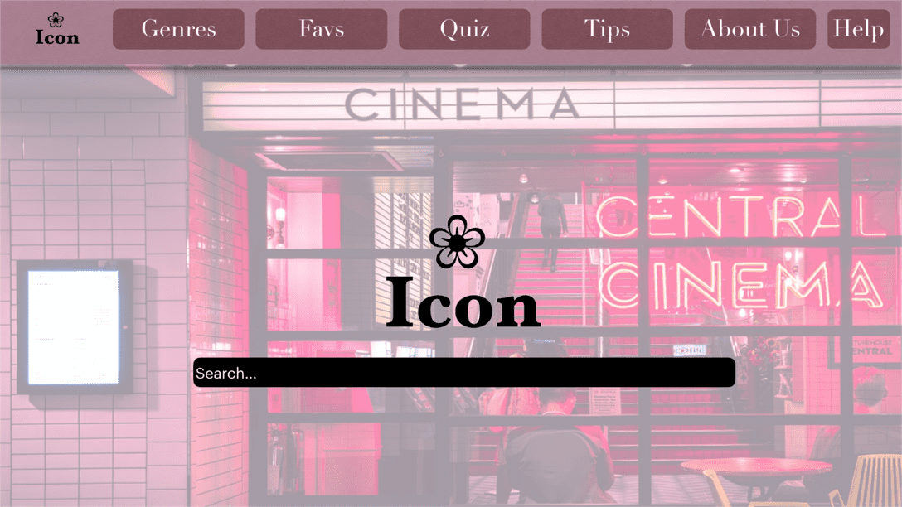

+++
title = "Der Weg zum Ziel"
date = "2020-10-21"
draft = false
pinned = false
image = "bruno-bergher-8ttvm3ca94-unsplash-1-.jpg"
+++
Heute haben wir alleine gearbeitet, da Marco in der Quarantäne ist. Anoja und ich hatten am Anfang Probleme mit den Computern und mussten den Gruppenraum wechseln und mehrere Computer ausprobieren. Als wir einen funktionierenden Computer gefunden haben, besprachen wir, was mir machen wollten. Wir programmierten bis zum Teil 2. Das Programmieren ging recht gut, da die Anleitung sehr hilfreich ist. Ausserdem haben wir noch ein Brainstorming gemacht und aufgeschrieben was alles in die Webseite kommen soll. Diese Ideen haben wir schlussendlich auf das iPad gebracht und ein Design zustande gebracht. Wir wissen, dass noch ein langer und holpriger Weg vor uns ist. Jedoch mithilfe von Marco und der Zusammenarbeit bekommen wir unsere Webseite sicher zustande!

Hier sieht man eine Idee von unserer zukünftigen Website. Jedoch sind wir nicht zufrieden damit.