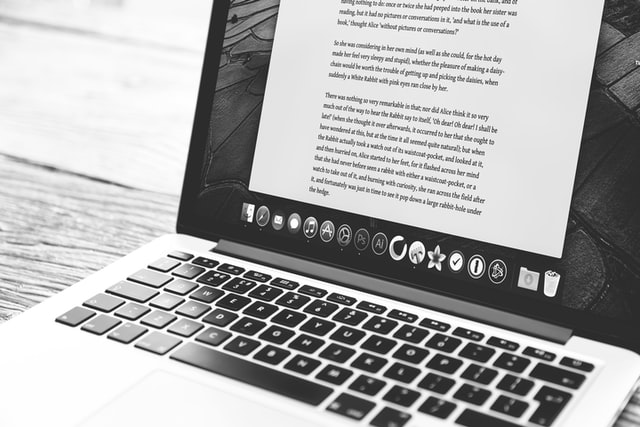

+++
title = "Erreichtes"
date = "2021-02-03"
draft = false
pinned = false
image = "glenn-carstens-peters-npxxwgq33zq-unsplash-1-.jpg"
+++
Marco hat uns heute mitgeteilt, dass wir ins Homeoffice gehen können. Aus diesem Grund haben Anoja und ich uns entschieden von zu Hause aus zu arbeiten.

### Texte verfassen und soziale Medien pflegen

Da Anoja programmierte, habe ich heute Texte verfasst. Diese Texte dienen als Zusammenfassung für die jene Serie. Die Zusammenstellung der Texte kann sehr aufwändig sein, da ich nicht mehr immer genau weiss was die Handlung ist. Da die Zusammenstellung der Texte mit der Zeit mühsam wird, habe ich mich entschieden die sozialen Medien zu pflegen. Ich habe mir überlegt was für Story oder Beiträge wir posten könnten, oder wem wir noch folgen sollten. 

Ausserdem haben wir dieses A3 Blatt ausgefüllt, welches Marco uns ausgeteilt hat. Bei den Lösungen sind wir nicht weitergekommen, da wir nicht wissen, was es für Lösungen gäbe. Wir müssen uns dort noch Gedanken machen.

