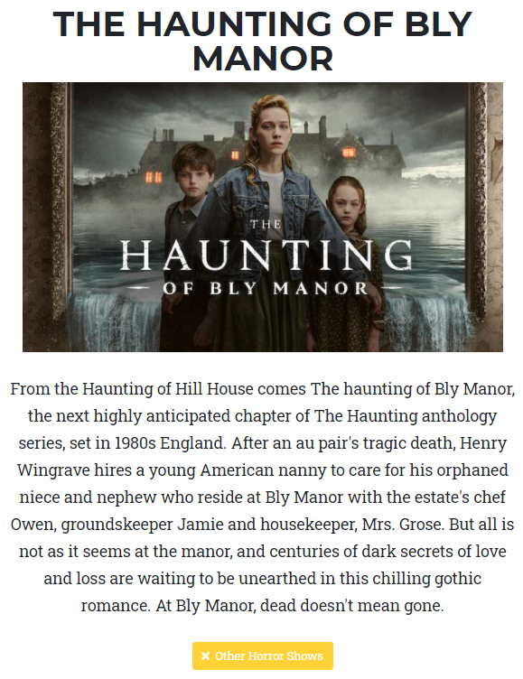

+++
title = "Neuer Name"
date = "2020-12-09"
draft = false
pinned = false
image = "resize.jpg"
+++
#### Resultat des Coronatests

Heute vor einer Woche bekam ich per SMS mein Resultat des Coronatests. Ich konnte es nicht fassen, dass es positiv war. Ich kam am Anfang in einen kurzen Schockzustand, der aber schnell verging. Ich fragte mich: Wie habe ich den Virus bekommen, obwohl ich alle Massnahmen einhalte? Ich kann diese Frage noch heute nicht beantworten und werde sie nie beantworten können. Ich musste bis am 23:59 07.12.2020 in Isolation bleiben und durfte mein Zimmer nur verlassen, falls ich auf die Toilette musste. Meine Familie musste sich in Quarantäne begeben, konnten sich aber im ganzen Haus aufhalten. Heute geht es mir gut und Symptome habe ich schon seit Samstag nicht mehr.

#### Heutiger Arbeitsprozess

Wir konnten heute wieder zusammen im gleichen Raum arbeiten. Bei der Webseite sind wir voran gekommen, jedoch gibt es immer noch viele Probleme. Ebenfalls konnten wir ein Logo erstellen und einen Namen für unsere Webseite geben. Der Name lautet: "Webisodes". Dieser ist eine Zusammenstellung von Web und Episodes. In den folgenden Wochen werden wir ebenfalls an der Webseite arbeiten. Da Anoja besser im programmieren ist, versuche ich sie so gut wie möglich zu unterstützen. Nächste Woche werde ich Vorarbeit leisten und zwar alle Bilder gleichgross machen.

