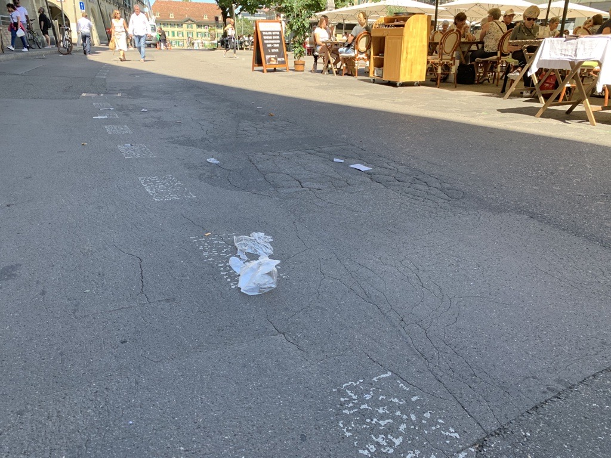
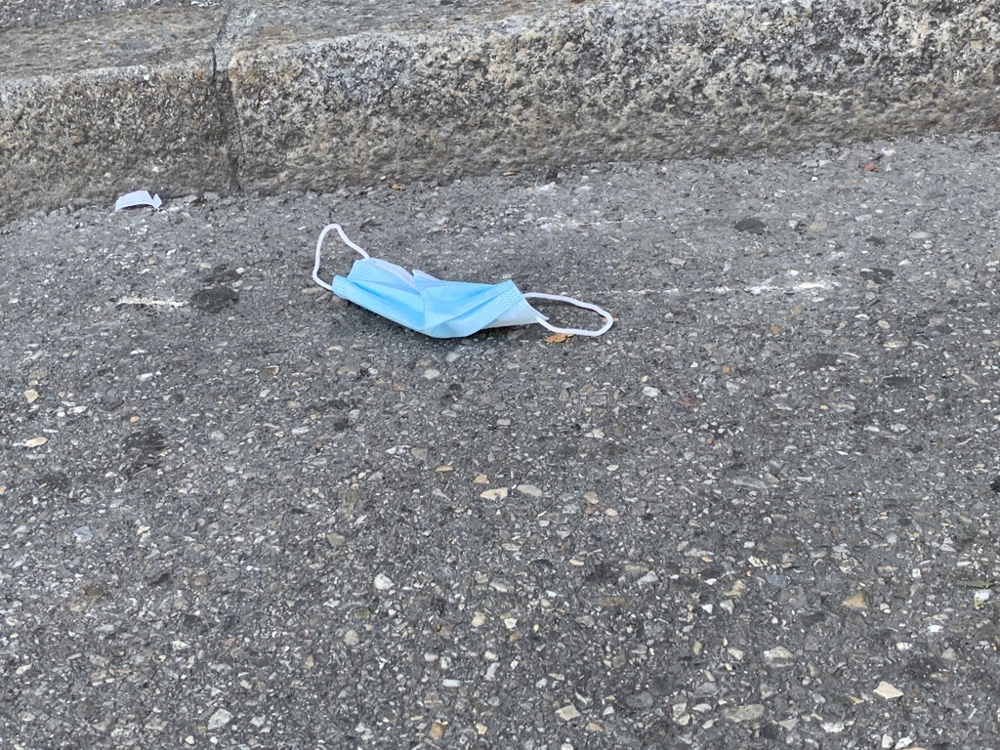

+++
title = "Probleme und Lösungen"
date = "2020-08-26"
draft = false
pinned = false
image = "netflix.png"
+++
Das Ziel des heutigen Nachmittags war es mehrere Probleme zu finden und dazu auch Lösungen zu finden. Ausserdem mussten wir auch auf der Strasse Personen fragen, was ihnen an das Problem stört. Anoja und ich sind diesbezüglich mit dem Tram zur Stadt Bern gefahren.

In Bern haben wir beim Bärenplatz viel Abfall gesehen, obwohl die Mülleimer in der Nähe waren. Uns hat es gestört, dass es Personen gibt, die den eigenen Abfall nicht wegwerfen können, vor allem auch Hygienemasken. Zu diesem Problem haben wir nicht wirklich eine Lösung, aber man könnte die Personen hinweisen den Müll richtig zu entsorgen. Denn Die Hygienemasken sollen vom Nutzer weggeworfen werden und nicht von einer Drittperson.

Was und auch aufgefallen ist, dass es viele McDonald's gibt. Dort kann man für wenig Geld essen und zwar ungesund, wie jeder weiss. Unsere Frage ist: Wo gibt es Läden wo man gesund und billig essen kann? Uns ist kein Laden in den Sinn gekommen und ebenfalls keine Lösung.

Ein weiteres Problem sind die ganzen Logos in der Stadt Bern. Da alle Logos wie praktisch "aufeinander/nebeneinander" sind, liest sie niemand. Dies macht sie auch schlussendlich sehr überflüssig.

Bei unserem letzten Problem haben wir auch ein Jugendlichen eine Frage gestellt. Das Problem geht um Netflix. Netflix hat viele Serien und Filme, jedoch noch lange nicht alle. Also wo sollte man denn die Serien streamen, falls Netflix diese Serie nicht hat? Er wüsste es auch nicht, die einzige Lösung wäre es zu warten oder auf eine andere Streamer-Plattform zu gehen.

Das Ziel des heutigen Nachmittags war es mehrere Probleme zu finden und dazu auch Lösungen zu finden. Ausserdem mussten wir auch auf der Strasse Personen fragen, was ihnen an das Problem stört. Anoja und ich sind diesbezüglich mit dem Tram zur Stadt Bern gefahren.

In Bern haben wir beim Bärenplatz viel Abfall gesehen, obwohl die Mülleimer in der Nähe waren. Uns hat es gestört, dass es Personen gibt, die den eigne