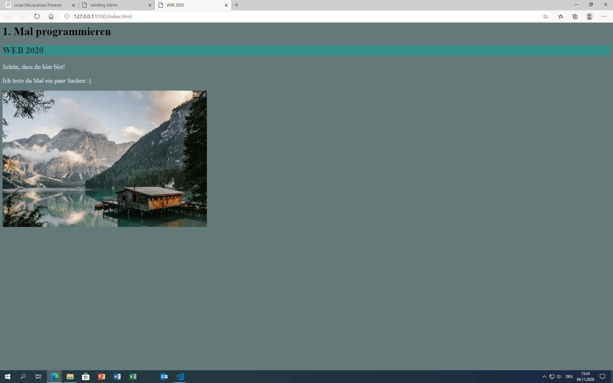

+++
title = "Programmieren, Programmieren"
date = "2020-11-04"
draft = false
pinned = false
image = "christopher-gower-m_hrflhgabo-unsplash-1-.jpg"
+++
Die Entscheidungen des Bundesrates wurden letzten Mittwoch getroffen. Alle Schulen bleiben offen, ausser Hochschulen und Unis offen. Meiner Meinung nach könnten sie die Mittelschulen auch schliessen...

Trump oder Biden? Dies ist heute auch die grosse Frage, den in den nächsten Tagen wird der nächste Präsident der Vereinigten Staaten von Amerika gewählt. Mittlerweile sieht es besser für Joe Biden aus, jedoch denke ich, dass Donald Trump gewinnen wird. Ich bin sehr gespannt wer in den nächsten Tagen gewählt wird.

Im WEB haben Anoja und ich weiter programmiert. Momentan sind wir bei Teil 4 von 7. Das Programmieren fällt mir nicht mehr so schwer wie am Anfang, denn wie auch Marco gesagt hat, Programmieren ist auch nur eine "Sprache" die man mit der Zeit immer wie besser beherrscht. Das Hauptthema war heute vor allem das CSS. Dort mussten wir die vorhandene Webseite bearbeiten. Also zum Beispiel die Grösse, die Farbe oder den Hintergrund der Texte formatieren. \
Gegen Schluss haben wir uns noch mit der Idee von unserem Projekt befasst.

Mit Hilfe von CSS habe ich heute meine Webseite von letzter Woche bearbeitet.