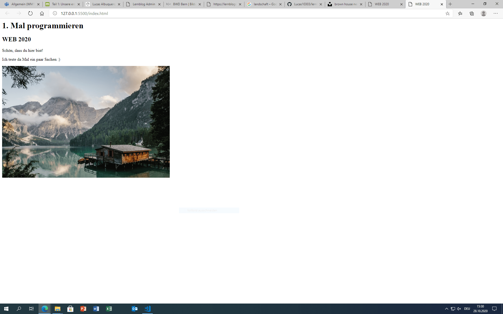

+++
title = "Programmierkünste verbessern"
date = "2020-10-28"
draft = false
pinned = false
image = "print-screen.png"
+++
Heute war meine Teamkollegin Anoja krank und somit nicht im WEB. Falls wir zukünftig weiterhin Präsenzunterricht haben werden viele immer wieder in Quarantäne gehen müssen. Das Corornavirus schlägt in der Schweiz stark zu, nur heute waren es fast 9'000 Fälle in der Schweiz. Der Bundesrat wird heute die weiteren Massnahmen entscheiden und ich persönlich möchte wieder Homeschooling haben. Praktisch alle von dem Freifach wünschen sich nach Hause zu gehen. Ich hoffe, dass unser Wunsch in Erfüllung gehen wird. Bald beginnt die Medienkonferenz, ob wir nächste Woche schon zu Hause sein werden, weiss bis jetzt noch niemand.

Im WEB habe ich heute meine Programmierkünste ein bisschen verbessert, da ich darin noch nicht sehr gut bin. Mit der Anleitung versteht man es aber sehr gut. Nächste Woche werde ich mit Anoja unsere nächsten Schritte besprechen und das Design wahrscheinlich neu machen. Das Design hat uns beiden nicht gefallen und wir müssen einen guten Prototyp entwerfen, der unseren Wünschen entspricht. Mal schauen ob ich dieser Besprechung mit Anoja per Teams haben werde oder noch im Klassenzimmer.                                                                                                                                                                            

Diese Webseite habe ich heute in kurzer Zeit kreiert.