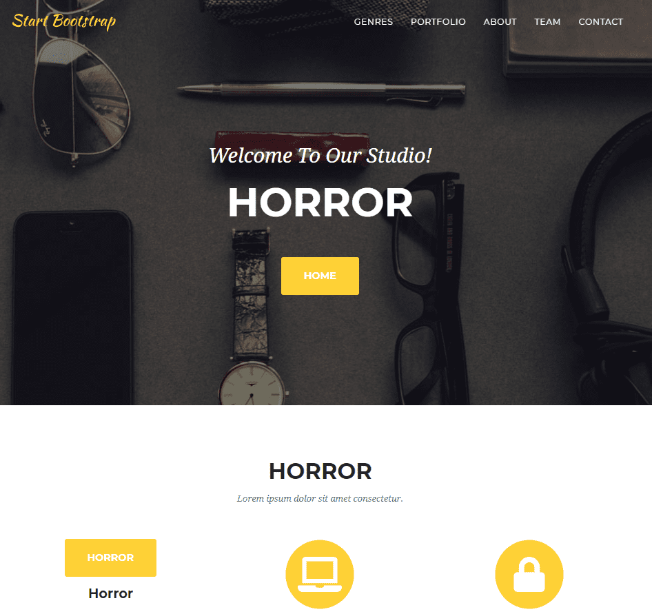

+++
title = "Start des Projekts"
date = "2020-11-18"
draft = false
pinned = false
image = "photo-1586281380117-5a60ae2050cc.jpg"
+++
##### Die Neue Idee

Anoja und ich haben heute viel gearbeitet. Zuerst haben wir uns mit der Planung und unserer Idee befasst. Da kam wieder das Thema mit dem Quiz, dass wir erstellen möchten. Marco gab uns die Idee, dass wir Anfragen manuell bearbeiten können und eine persönliche Empfehlung zu schreiben. Dazu bräuchte man in der Webseite ein Fenster wo man uns kontaktieren kann. Dies funktioniert jedoch nur, wenn es wenige Anfragen gibt, falls wir zu viele Anfragen hätten, müsste der Computer es für uns übernehmen. Beide Ideen stehen noch offen und wir müssen uns mit beiden besser auseinandersetzen.

##### Start des Projekts

Wir konnten endlich mit unserer Webseite beginnen. Dazu haben wir ein Template heruntergeladen und können jetzt damit arbeiten. Die html des Templates ist sehr lange und sehr komplex und wir müssen uns da Schritt für Schritt durcharbeiten. Momentan machen wir gerade eine Testversion mit 9 verschiedenen Serien, hoffentlich kommt es gut raus. Wir wissen, dass vor uns sehr viel Arbeit steckt, jedoch sind wir motiviert an diesem Projekt weiter zu arbeiten und es zu vollenden.

Momentan sind wir noch nicht sehr weit, aber hier mal eine IST-Stand von unserer Webseite.