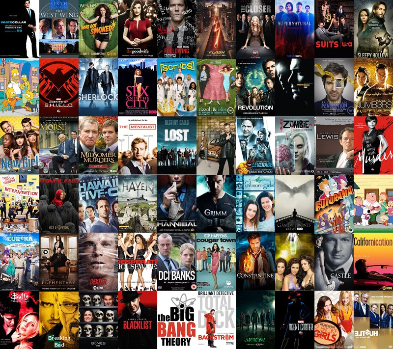

+++
title = "Web im 3. Ausbildungsjahr"
date = "2020-08-12"
draft = false
pinned = false
+++
#### **Was möchte ich lernen?**

Ich möchte Photoshop und das Programmieren lernen.

#### In welchem Bereich möchte ich arbeiten?

Mein Blog soll über etwas sein, dass ich gerne mag. Hier eine Auflistung dazu:

* Autos
* Serien
* Essen

Wahrscheinlich werde ich mich mit jemanden zusammenschliessen und eine App oder eine Website erstellen über Serien. Dort würden wir Empfehlungen und kleine Zusammenfassungen schreiben. Auch würde stehen wie viele Folgen diese Serien haben. Somit können sich andere darüber informieren, da wir schon viele Serien geschaut haben.

