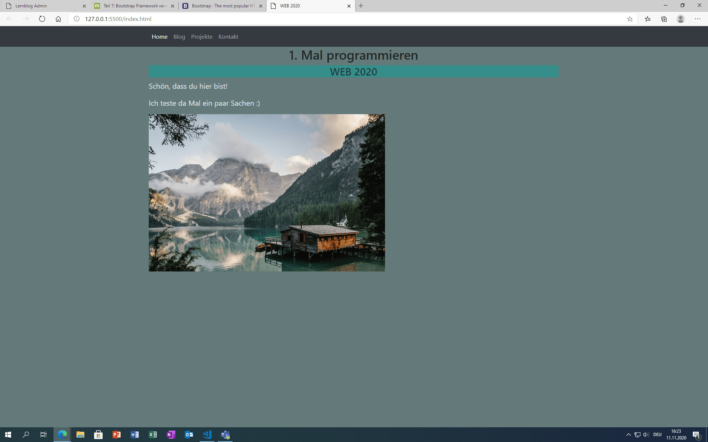

+++
title = "Webdesign"
date = "2020-11-11"
draft = false
pinned = false
image = "design.jpg"
+++
Die Präsidentswahlen für die Vereinigten Staatensind durch. Trump hat verloren und Biden hat mit mindestens 290 Wahlmänner gewonnen. Joe Biden wird für die nächsten 4 Jahren der Präsident der USA.

#### Webseite designen

Heute haben Anoja und ich weiter programmiert, bald sind wir fertig. Wir bearbeiten gerade die letzten Schritte des 7. Teils. Ich habe heute viel dazu gelernt und auch, dass das Programmieren wirklich nicht einfach ist. Bootstrap ist ein wichtiger Tool für die Website zu gestalten.  Mit dem haben wir heute gearbeitet und es ist sehr hilfreich damit die Seiten besser aussehen.

#### Nächste Schritte

Nächste Woche muss ich noch meine Website so programmieren, dass man sie ach auf dem Handy öffnen kann. Ebenfalls muss ich noch die anderen Seiten formatieren, denn ich habe erst die Home-Seite formatiert. Anoja, Marco und ich müssen uns noch zusammen setzten, damit wir wegen dem Design unserer eigenen Website (Serien) schauen können. Eine Option wäre eine Website von Beginn an zu programmieren oder eine vorprogrammierte zu benutzen.

Im Vergleich zur letzter Woche sieht meine Webseite ganz anders aus.