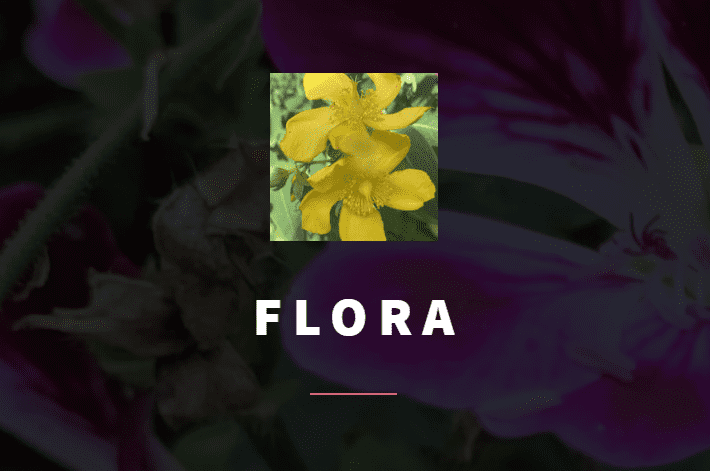

+++
title = "Blumenladen Flora"
date = "2020-08-19"
draft = false
pinned = false
image = "flora.png"
+++
Heute haben wir im WEB Zeit gehabt unsere eigene Website zu erstellen. Ich war mit Anoja in der Gruppe. Dafür hatten wir 30 Minuten um eigene Fotos von Pflanzen zu machen in der Umgebung und eine Skizze über die Website zu machen. Danach kreierten wir in 45 Minuten unsere eigene Website. Marco hat uns das Thema "Blumenladen" gegeben. Die Website zu erstellen war nicht all zu schwierig, da man schon Designs auswählen konnte.

Unsere Seite hat noch viel Verbesserungspotenzial, denn wir haben erst die erste Seite fertiggestellt. Wir müssen noch bei den Produkten Bilder einfügen und den Button verlinken. Auch die Öffnungszeiten fehlen und vieles mehr. In 45 Minuten haben wir als Gruppe viel erreicht.

**Link:**

<!--StartFragment-->

[https://flora-bern.carrd.co/](https://flora-bern.carrd.co/ "https\://flora-bern.carrd.co/")

<!--EndFragment-->